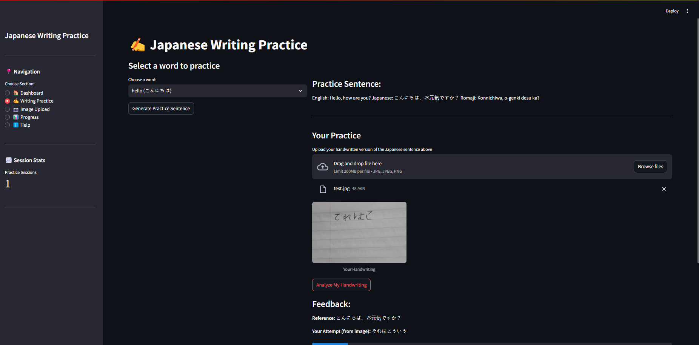

# Japanese Writing Practice App ✍️


*Screenshot of the Japanese Writing Practice application interface*

## Overview

This Streamlit application helps users practice writing Japanese through an interactive web interface. It's designed for Japanese language learners who want to improve their writing skills with real-time feedback.

## Features

- **Vocabulary Practice**: Practice writing using a curated list of Japanese vocabulary words
- **Sentence Generation**: Generate contextual Japanese sentences based on vocabulary words using GPT-4o
- **OCR Integration**: Upload images of handwritten Japanese text for automatic recognition
- **AI-Powered Feedback**: Receive detailed feedback on your writing, including accuracy scores and corrections
- **Progress Tracking**: Track your progress across practice sessions

## Application Screenshot

The file `image.png` in this repository shows the application interface. The interface provides an intuitive way to practice Japanese writing with several key sections accessible from the sidebar navigation.

## Installation

### Prerequisites

- Python 3.7+
- pip

### Required Packages

```bash
pip install streamlit requests openai pandas pillow
```

### Optional OCR Functionality

For handwriting recognition capabilities:

```bash
pip install manga-ocr
```

Note: The MangaOCR package is optional but recommended for full functionality.

## Usage

1. Clone the repository
2. Install the required dependencies
3. Run the application:

```bash
streamlit run app.py
```

## Application Structure

The application is organized into several sections:

### 🏠 Dashboard
- Welcome screen
- Overview of available vocabulary

### ✍️ Writing Practice
- Select vocabulary words
- Generate practice sentences
- Upload handwritten practice attempts
- Receive AI-generated feedback

### 📷 Image Upload
- Standalone OCR functionality
- Upload any Japanese handwriting for text recognition

### 📊 Progress
- Track your practice history
- View improvement metrics over time

### ℹ️ Help
- Instructions for using the application
- Tips for Japanese writing practice

## Technical Details

### Technologies Used

- **Streamlit**: Frontend web framework
- **OpenAI GPT-4o**: Sentence generation and writing evaluation
- **MangaOCR**: Japanese handwriting recognition
- **Pandas**: Data management for vocabulary and stats
- **PIL**: Image processing for uploaded handwriting samples

### Key Components

- **JapaneseWritingApp Class**: Main application controller
- **AppState Enum**: Manages application state transitions
- **OCR Integration**: Processes uploaded images to extract Japanese text
- **AI Grading System**: Evaluates handwriting accuracy and provides feedback

## How It Works

1. **Generate Practice Content**: Select a vocabulary word to generate a practice sentence
2. **Practice Writing**: Write the Japanese sentence on paper
3. **Upload Your Writing**: Take a photo and upload it to the application
4. **Receive Feedback**: OCR detects your handwriting and AI provides personalized feedback
5. **Track Progress**: Monitor your improvement over time

## Development

The application follows a class-based structure centered around the `JapaneseWritingApp` class. The main components include:

- **State Management**: Using Streamlit's session state to persist data between reruns
- **UI Rendering**: Methods to render different sections of the interface
- **AI Integration**: OpenAI API calls for sentence generation and evaluation
- **OCR Processing**: Image analysis for Japanese character recognition

## Contributing

Contributions to improve the application are welcome. Some possible enhancements:
- Adding more vocabulary words
- Improving OCR accuracy
- Expanding to other Japanese language learning features
- Adding user accounts for persistent progress tracking

## License

[Add your license information here]

## Acknowledgements

- This project uses MangaOCR for Japanese text recognition
- Powered by OpenAI's GPT-4o for natural language processing tasks
